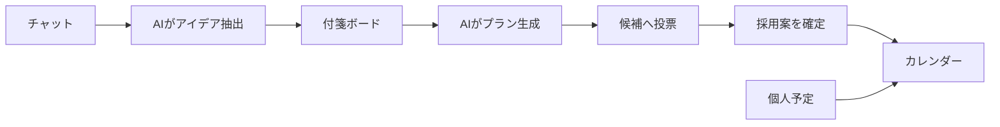
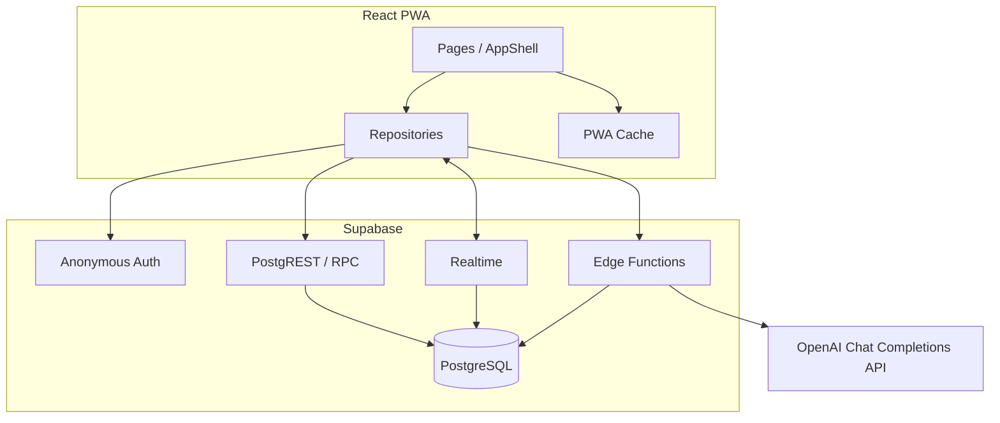

# タビアミ

[](https://github.com/sora-33/AIAU/actions/workflows/ci.yml)

**会話から生まれた「行きたい」を、みんなで決める旅程へ。**

タビアミは、旅行やお出かけの相談をチャットで進めながら、AIがアイデアを付箋として整理し、投票可能なタイムラインとカレンダーへつなげる共同旅行プランナーです。

- 匿名で旅行を作成・参加
- チャットから AI がアイデアを抽出
- 付箋をユーザー自身で追加・編集・並べ替え
- AI が時間軸のプランを生成
- 候補への投票、採用案の確定、変更履歴の復元
- 確定プランと個人予定をカレンダーで一元管理
- リアルタイム同期（Supabase Realtime）、ICS出力、同時更新競合の検出・解決

## 目次

- [プロダクトの流れ](#プロダクトの流れ)
- [主な機能](#主な機能)
- [アーキテクチャ](#アーキテクチャ)
- [技術スタック](#技術スタック)
- [ローカル開発](#ローカル開発)
- [環境変数](#環境変数)
- [コマンド](#コマンド)
- [ディレクトリ構成](#ディレクトリ構成)
- [データとセキュリティ](#データとセキュリティ)
- [テストとCI](#テストとci)
- [ドキュメント](#ドキュメント)
- [既知の制約](#既知の制約)
- [コントリビューション](#コントリビューション)
- [ライセンス](#ライセンス)

## プロダクトの流れ

タビアミの体験は、3つの画面でつながっています。

| 画面 | 役割 | 主な操作 |
| --- | --- | --- |
| **1. アイデアボード + チャット** | 会話から「行きたい」「やりたい」を集める | チャット、AI抽出、付箋CRUD、保留・復帰、並べ替え |
| **2. タイムラインプラン** | アイデアを時間軸に配置し、みんなで決める | AI生成・再生成、投票、採用案確定、履歴preview・復元 |
| **3. カレンダー** | 確定した旅行予定と個人予定をまとめる | 日・週・月・アジェンダ表示、個人予定編集、ICS出力、競合解決 |



PR #11時点のUI設計と操作意図を参照できるよう、静的モックを設計資料として [`mockups/`](mockups/) に残しています。`mockups/`のHTML・JavaScript・データはReact runtimeで使用せず、画面スタイルは別ファイルの[`src/mockups.css`](src/mockups.css)から読み込みます。

## 主な機能

### 旅行と共同編集

- Supabase Anonymous Auth による自動セッション開始
- 旅行作成と招待リンク／トークンによる参加
- 招待リンクから参加フォームへトークンを自動入力
- 旅行単位のメンバー一覧とニックネーム表示
- 旅行ごとに分離されたデータと、Supabase Realtimeによるリアルタイム購読

### アイデアボード + チャット

- メンバー間のリアルタイムチャット
- チャット送信後のデバウンス付きAI抽出
- AI付箋と手動付箋の区別
- タイトル、メモ、任意属性の編集
- 付箋の保留・復帰・論理削除
- Pointer操作とキーボード操作による並べ替え
- AI変更の根拠となった発言への導線
- ユーザーが編集した付箋をAIの自動更新から保護

### タイムラインプラン

- 付箋と旅行期間をもとにしたAIプラン生成・再生成
- 日付ごとのタイムライン（横軸: 時刻）
- 同じ時間帯の複数候補を保持・比較
- 予定間の移動を独立した移動時間として表示
- 1ユーザー・1スロット・1票の投票
- 最多票候補の確定
- バージョン履歴、過去版preview、最新版としての復元
- 楽観的バージョン管理による同時更新競合の検出

### カレンダー

- FullCalendarによる日・週・月・アジェンダ表示
- 確定したプラン予定の表示
- 個人予定の作成・編集
- 旅行プラン・元の付箋への導線
- 旅行プランのICS書き出し
- 個人予定の同時更新競合を検出し、ローカル版／サーバー版から残す内容を選択
- PWAキャッシュを利用したカレンダーフィードの耐障害性

## アーキテクチャ



React側では、ページから直接fixtureを読み込まず、`repositories` と `services` を通してSupabaseへアクセスします。旅行、参加者、チャット、付箋と配置座標（x / y）、プラン、候補、投票、履歴、予定、競合のsource of truthはSupabaseです。

### Supabaseの利用範囲

| 機能 | 利用箇所 |
| --- | --- |
| Auth | Anonymous Sign-Inと`auth.uid()`によるユーザー識別 |
| Database / PostgreSQL | 旅行、メンバー、チャット、付箋、プラン、個人予定、履歴の永続化 |
| PostgREST | Repository層から単一テーブルをCRUD |
| RPC | 旅行作成・参加、AI結果適用、投票、確定、履歴復元、競合解決をtransaction実行 |
| Realtime | messages、notes、trip_members、plan_slots、plan_options、votes、plan_versions、personal_events、offline_conflictsの変更を画面へ反映 |
| Edge Functions | OpenAI付箋抽出・プラン生成、ICS出力 |

### Edge Functions

| Function | 役割 |
| --- | --- |
| `extract-notes` | 未処理チャットを読み、付箋の追加・更新・保留を適用 |
| `generate-plan` | 付箋、旅行期間、個人予定、予定間の移動時間を考慮してタイムラインを生成 |
| `export-ics` | 確定済みプランをICSとして出力 |

`OPENAI_API_KEY`が未設定・無効、またはOpenAI APIが失敗した場合、`extract-notes`と`generate-plan`はAI結果を生成・適用せず、runをfailedにして画面へ明示的なエラーを返します。既存の付箋とプランは変更しません。

## 技術スタック

| レイヤー | 技術 |
| --- | --- |
| Frontend | TypeScript 6、React 19、React Router 7、Vite 8 |
| UI | Tailwind CSS 4、shadcn/ui、Base UI、Lucide、Sonner |
| Calendar | FullCalendar 6 |
| Backend | Supabase Auth、PostgreSQL、PostgREST、RPC、Realtime、Edge Functions |
| Validation | Zod 4、PostgreSQL制約、RLS |
| PWA | vite-plugin-pwa、Workbox |
| Test | Vitest、pgTAP、Supabase Integration Test 、 Devin |
| CI | GitHub Actions、Node.js 24 |
| AI | Devin |
| LLM | Open AI |

## ローカル開発

### 前提条件

- Node.js 24
- npm
- Docker Desktop または互換Docker環境
- Git

Supabase CLI はdev dependencyに含まれているため、グローバルインストールは不要です。

### 1. リポジトリを準備

```bash
git clone https://github.com/sora-33/AIAU.git
cd AIAU
npm ci
```

### 2. ローカルSupabaseを起動

```bash
npm run supabase:start
npx supabase status -o env
```

初回起動時にMigrationとseedが適用されます。ローカル設定ではAnonymous Sign-Insが有効です。

### 3. 環境変数を設定

PowerShell:

```powershell
Copy-Item .env.example .env.local
```

macOS / Linux:

```bash
cp .env.example .env.local
```

ルートの`.env.local`を開き、`npx supabase status -o env`の`API_URL`を`VITE_SUPABASE_URL`、`PUBLISHABLE_KEY`を`VITE_SUPABASE_PUBLISHABLE_KEY`へ設定します。OpenAIを使う場合は`OPENAI_API_KEY`も設定します。

```dotenv
VITE_SUPABASE_URL=http://127.0.0.1:54321
VITE_SUPABASE_PUBLISHABLE_KEY=<local publishable key>
OPENAI_API_KEY=<OpenAI API key>
OPENAI_MODEL=gpt-4o-mini
```

Viteがブラウザへ公開するのは`VITE_`で始まる変数だけです。`OPENAI_API_KEY`はFrontend bundleへ含まれません。`.env.local`や秘密鍵をcommitしないでください。

### 4. Edge Functionsを起動

別ターミナルで、同じ`.env.local`を明示して実行します。

```bash
npx supabase functions serve --env-file .env.local
```

OpenAIが未設定または失敗した場合、AI結果を生成せずエラーを返し、付箋・プランを変更しません。

### 5. Viteを起動

さらに別ターミナルで実行します。

```bash
npm run dev
```

Viteが表示したLocal URLをブラウザで開きます。初回アクセス時に匿名セッションが自動作成されます。

### 6. 終了

```bash
npm run supabase:stop
```

## 環境変数

### Frontend

| 変数 | 必須 | 用途 |
| --- | --- | --- |
| `VITE_SUPABASE_URL` | Yes | Supabase Project URL |
| `VITE_SUPABASE_PUBLISHABLE_KEY` | Yes | ブラウザ向けPublishable Key |

### Edge Functions Secrets

| 変数 | 必須 | 用途 |
| --- | --- | --- |
| `OPENAI_API_KEY` | AI使用時 | OpenAI API認証キー |
| `OPENAI_MODEL` | No | 呼び出すモデル。既定値は`gpt-4o-mini` |

Hosted Supabaseでは、DashboardでAnonymous Sign-Insを有効化し、`npx supabase secrets set --env-file .env.local --project-ref <project-ref>`でEdge Function Secretsを設定します。Clientへ渡すのはProject URLとPublishable Keyだけです。Service Role KeyとOpenAI API KeyをFrontendへ配置してはいけません。

## コマンド

| コマンド | 内容 |
| --- | --- |
| `npm run dev` | Vite開発サーバーを起動 |
| `npm run build` | TypeScript project build + Vite production build |
| `npm run preview` | production buildをローカルpreview |
| `npm run lint` | oxlintを実行 |
| `npm run test` | Vitest unit / contract testを実行 |
| `npm run test:integration` | ローカルSupabaseを使うIntegration testを実行 |
| `npm run verify` | lint + test + buildを順番に実行 |
| `npm run supabase:start` | ローカルSupabaseを起動 |
| `npm run supabase:stop` | ローカルSupabaseを停止 |
| `npm run db:reset` | ローカルDBへMigrationとseedを再適用 |
| `npm run db:test` | pgTAP DB testを実行 |
| `npm run types:generate` | ローカルDBからTypeScript型を再生成 |

`db:reset` はローカルDBを再作成します。必要なローカルデータがある場合は、実行前に退避してください。

## ディレクトリ構成

```text
AIAU/
├─ src/
│  ├─ components/        # 共通layoutとUI component
│  ├─ hooks/             # 匿名session bootstrap
│  ├─ pages/             # Home / Ideas / Plan / Calendar
│  ├─ repositories/      # Supabase table・RPC・Realtime access
│  ├─ services/          # AI連携
│  ├─ test/              # UI contract / Supabase integration
│  └─ types/             # Supabase生成型とdomain alias
├─ supabase/
│  ├─ functions/         # Edge Functions
│  ├─ migrations/        # schema、RLS、RPC、Realtime、hardening
│  ├─ tests/             # pgTAP schema test
│  ├─ config.toml        # local Supabase設定
│  └─ seed.sql           # seed entrypoint
├─ mockups/              # PR #11の静的UI資料（runtime未使用）
├─ docs/                 # 要件・設計資料
└─ .github/workflows/    # CI
```

## データとセキュリティ

- **RLS**: 旅行データは`trip_members`のmembershipで分離
- **Anonymous Auth**: ユーザーIDはSupabase Authから取得し、Client入力を信用しない
- **RPC境界**: 旅行作成、参加、投票、確定、履歴復元、競合解決をDB側で検証
- **Token**: invite tokenは生値をDB保存せず、SHA-256 hashを保存
- **Secret分離**: Service Role KeyとOpenAI API KeyはEdge Functionsだけで利用
- **AI制約**: AIは付箋を削除できず、ユーザー編集済み付箋を自動上書きしない
- **履歴**: plan snapshotを追記し、復元も新しいversionとして記録
- **競合**: revisionとexpected versionで同時更新を検出
- **論理削除**: 共同編集データは削除時刻を記録し、履歴と参照整合性を維持

Supabase Authの匿名セッションはブラウザ保存データに依存します。ブラウザデータを削除した場合、同じ匿名アカウントへ戻れません。

## テストとCI

Pull Requestと`main`へのpushで、GitHub Actionsが次を実行します。

### `verify`

1. `npm ci`
2. `npm run verify`（oxlint + Vitest + TypeScript / Vite production build）

### `database`

1. ローカルSupabase起動
2. pgTAP DB test
3. Database lint
4. Edge Functions起動
5. 匿名2ユーザーによるIntegration test
6. ローカルSupabase停止

ローカルでPR相当のFrontend検証をまとめて実行する場合:

```bash
npm run verify
```

DBとEdge Functionsを含む検証は、Supabaseを起動してから実行します。

```bash
npm run supabase:start
npm run db:test
npx supabase db lint --local --level warning
npx supabase functions serve
```

Integration testはEdge Functionsを起動したまま、別ターミナルでローカルAPI URLとPublishable Keyを渡します。

PowerShell:

```powershell
$env:SUPABASE_TEST_URL = "http://127.0.0.1:54321"
$env:SUPABASE_TEST_KEY = "<local publishable key>"
npm run test:integration
```

macOS / Linux:

```bash
eval "$(npx supabase status -o env)"
SUPABASE_TEST_URL="$API_URL" SUPABASE_TEST_KEY="$PUBLISHABLE_KEY" npm run test:integration
```

## ドキュメント

| ドキュメント | 内容 |
| --- | --- |
| [`docs/requirements.md`](docs/requirements.md) | 3画面の機能要件 |
| [`docs/screen1-requirements.md`](docs/screen1-requirements.md) | アイデアボード + チャットの詳細要件 |
| [`docs/screen3-calendar.md`](docs/screen3-calendar.md) | カレンダー要件の決定記録 |
| [`docs/backend-supabase-plan.md`](docs/backend-supabase-plan.md) | Supabase schema、RLS、RPC、Realtime、Edge Functions設計 |
| [`mockups/`](mockups/) | 静的UIモック。実データ・React runtimeとは分離 |
| [`BRANCHING.md`](BRANCHING.md) | ブランチ戦略と命名規則 |
| [`CONTRIBUTING.md`](CONTRIBUTING.md) | 開発フローとレビュー方針 |
| [`.github/pull_request_template.md`](.github/pull_request_template.md) | Pull Requestテンプレート |

## 既知の制約

- 匿名アカウントの端末間同期・復旧は未対応
- 外部カレンダーとの双方向同期は未対応。現在はICS出力を提供
- タイムラインは複数候補を保持できるが、OpenAIが複数候補を生成する保証はない
- 移動手段・移動時間はAIによる概算であり、交通機関の時刻表や運行状況とは連携していない
- OpenAI APIが未設定または失敗した場合、AI付箋・プランは生成せず画面へエラーを表示
- `mockups/` は設計資料であり、Reactアプリのデータソースではない
- `seed.sql` はfixtureを投入せず、空のDBから開始する

## コントリビューション

1. Issueで目的と受入条件を整理
2. `main`から`<username>/<type>/<short-description>`または`<username>/<type>/<issue-number>-<short-description>`形式のブランチを作成
3. Conventional Commits形式でcommit
4. `npm run verify`を実行
5. Pull Requestテンプレートを埋めてレビューを依頼

詳細は [`CONTRIBUTING.md`](CONTRIBUTING.md) と [`BRANCHING.md`](BRANCHING.md) を参照してください。

## ライセンス

現在、このリポジトリにはライセンスが設定されていません。利用・改変・再配布条件が明示されるまでは、権利者の許可なく再利用できることを意味しません。
