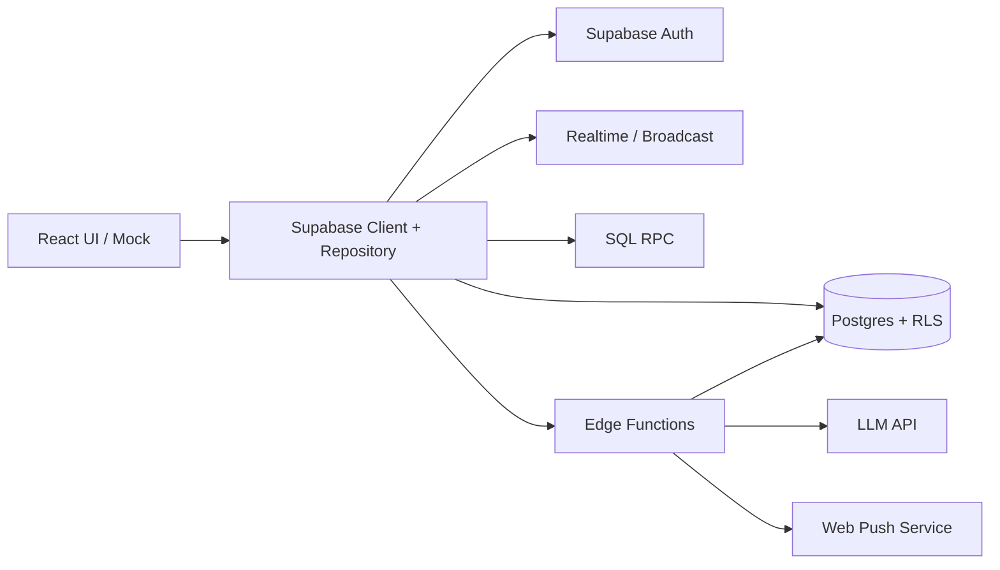

# バックエンド・Supabase 実装計画

AIAU の 3 画面を支える共通バックエンドと Supabase 連携の実装契約。

関連資料:

- [機能要件](requirements.md)
- [画面 1 詳細要件](screen1-requirements.md)
- [画面 3 決定記録](screen3-calendar.md)

## 1. 目的と担当範囲

3 画面が同じデータを矛盾なく扱えるよう、データモデル、認証・認可、Realtime、AI、変更履歴、外部連携の境界を先に固定する。

| 担当 | 範囲 |
| --- | --- |
| sora さん | 全 3 画面のモック作成、画面 3 |
| 林さん | 画面 1 |
| 賀屋 | 画面 2、全 3 画面のバックエンドと Supabase 連携 |

画面担当者は表示・操作を担当し、バックエンド担当は以下を担当する。

- Supabase Client の初期化と repository / service 層
- Database Migration、Seed、生成 TypeScript 型
- Auth、RLS、Realtime、Broadcast
- SQL RPC、Edge Functions
- AI 抽出・旅程生成
- 投票、変更履歴、非破壊復元
- 通知、共有、オフライン同期（外部カレンダー連携は将来拡張）

sora さんが作るモックは、後述する DTO と同じ形の fixture を使う。視覚設計とデータ契約を分離し、UI 完成前でもバックエンドを進められる状態にする。

## 2. 決定事項

- バックエンドは Supabase Postgres / Auth / RLS / Realtime / RPC / Edge Functions で構成し、別の常駐 API サーバーは初期導入しない。
- MVP は画面 3 の第 1 段階・第 2 段階を両方含む。
- ユーザーは Supabase 匿名 Auth で利用開始する。
- MVP の外部カレンダー連携は ics エクスポートのみとし、Google Calendar の OAuth・取り込み・双方向同期は将来拡張とする。
- 通知はアプリ内通知と Web Push の両方を実装する。
- オフライン競合は自動上書きせず、ローカル版 / サーバー版をユーザーが選択する。
- 投票は時間帯スロット単位で、1 参加者につき 1 スロット 1 票。票は変更できる。
- 旅行参加者なら誰でも採用案を確定できる。最多票候補を対象とし、同票時は同率最多候補から明示選択する。
- バージョン復元ではタイムライン構造と確定状態を戻すが、参加者の投票は巻き戻さない。
- 復元は過去の履歴を削除せず、復元結果を新しい最新バージョンとして追加する。

## 3. 対象外

以下は既存の Draft PR には記載があるが、マージ済み要件ではないため、本計画の実装対象に含めない。

- 予約・決済
- チケット画像等の Storage 添付
- Google Calendar を含む外部カレンダーの OAuth・予定取り込み・双方向同期
- 参加者別の別行動レーン
- 網羅的な鉄道ダイヤ・施設営業時間 API
- 旅行案へのコメント機能

## 4. アーキテクチャ



### 4.1 処理の配置

| 処理 | 配置 |
| --- | --- |
| 単一テーブルの単純 CRUD | Supabase Client + RLS |
| 複数テーブルをまとめて更新する処理 | SQL RPC |
| LLM、Web Push、ics 生成 | Edge Functions |
| 共同編集の確定結果 | Postgres Changes |
| ドラッグ中の一時座標 | Realtime Broadcast |

### 4.2 共通原則

- 画面 2 と画面 3 のプラン予定を複製しない。同じ正規レコードを両画面から参照する。
- 画面 3 の MVP カレンダー feed は、確定プラン予定と個人予定を期間指定で統合する。外部予定は将来拡張で追加する。
- DB の時刻は `timestamptz`、旅行・ユーザーの timezone は IANA timezone 名で別途保持する。Client / RPC 間では UTC または offset 付き ISO 8601 を使用し、表示時だけ対象 timezone へ変換する。
- 更新対象には `updated_at` と必要に応じて `revision` を持たせる。
- 履歴・外部同期対象は物理削除せず、`deleted_at` または active 状態で論理削除する。
- 外部から渡された `user_id`、`trip_id`、`plan_id` を信用せず、JWT と DB 上の所属関係を検証する。

## 5. Supabase 構成

後続実装では以下を作成する。

```text
supabase/
  config.toml
  migrations/
  seed.sql
  functions/
    _shared/
    extract-notes/
    generate-plan/
    dispatch-push/
    export-ics/
    public-plan/
  tests/
```

- Migration を DB 定義の唯一の正本とする。
- Seed はモック fixture と同じ固定 ID・DTO を使用する。
- Migration 更新後に Supabase から TypeScript 型を生成する。
- `.env.example` には変数名のみを記載し、秘密値は入れない。

## 6. データモデル

### 6.1 共通・画面 1

| テーブル | 役割 | 主要フィールド・制約 |
| --- | --- | --- |
| `profiles` | Auth ユーザーの共通設定 | `id = auth.uid()`、timezone、通知既定値、匿名 / 正式状態 |
| `trips` | 旅行本体と AI 生成条件 | title、starts_at、ends_at、timezone、origin、budget、created_by |
| `trip_members` | 旅行ごとの参加者 | PK `(trip_id, user_id)`、nickname、role |
| `trip_invites` | 招待 URL | token_hash、expires_at、revoked_at。生 token は保存しない |
| `messages` | チャット発言 | trip_id、author_id、author_name、text、AI 処理状態、deleted_at |
| `notes` | 付箋 | 既存の画面 1 契約を維持 |
| `note_operations` | AI 操作の undo ログ | op、before_state、after_state、source_message_id、reverted_at |
| `ai_runs` | AI バッチ管理 | kind、status、input_hash、error、started_at、finished_at |

`trip_members.role` は `owner | member` とする。MVP では owner だけが旅行設定の変更と招待の発行・失効を行い、チャット・付箋・プラン編集・投票・確定は owner / member が同じ権限で行う。退出・メンバー削除の権限は実装PRまでに確定する。

`notes` は [画面 1 詳細要件](screen1-requirements.md) の「3. データモデル（インターフェース契約）」を維持する。

- `origin`: `ai | user`
- `status`: `active | held`
- `user_touched=true` の付箋へ AI の `update / hold` を適用しない。
- AI は付箋を削除できない。撤回は `held` へ遷移させる。
- AI 操作は必ず根拠メッセージと `note_operations` を持つ。
- 人間による undo は `before_state` へ戻し、操作ログ自体は削除しない。

`messages.deleted_at is not null` の発言は AI 処理対象から除外し、根拠参照では「削除済み」として扱う。物理削除して `note_operations` の参照を壊さない。

AI の二重適用を防ぐため、未処理発言を `ai_runs` 単位で原子的に claim する。`messages.processed` の読み取りだけで排他制御しない。

付箋のグルーピングは別オブジェクトを作らず、`x / y` 座標の近接を旅程生成の入力信号として扱う。近接閾値と座標の正規化方法は `generate-plan` の設定と fixture で固定する。

### 6.2 画面 2

| テーブル | 役割 | 主要フィールド・制約 |
| --- | --- | --- |
| `plans` | 旅行のタイムライン | trip_id、current_version、created_by、updated_at |
| `plan_slots` | 投票・確定単位となる時間帯 | plan_id、start_at、end_at、status、confirmed_option_id |
| `plan_options` | スロット内の候補 | slot_id、note_id、title、start_at、end_at、kind、attrs、reason、user_touched、deleted_at |
| `votes` | 参加者の選択 | UNIQUE `(slot_id, user_id)`、option_id |
| `plan_versions` | 変更履歴 | UNIQUE `(plan_id, version)`、actor、source、summary、snapshot |

`plan_slots.status` は `open | confirmed` とする。`confirmed` のときは同じ slot に属する active な `confirmed_option_id` を必須とする。

`plan_options.kind` は以下を扱う。

- `activity`: 付箋由来または手動追加の予定
- `travel`: 移動時間
- `all_day`: 宿泊・チケット期限等の終日予定
- `placeholder`: 未確定表示

整合性規則:

- 付箋由来の候補は `notes.id` を参照する。
- 移動・手動予定は `note_id` なしを許可する。
- option と投票対象 slot の所属一致を RPC で検証する。
- 投票時は option の `deleted_at is null` を検証し、集計でも active option の票だけを数える。
- `end_at > start_at` を DB 制約で保証する。
- 人手編集した候補は `user_touched=true` とし、AI 再生成で上書きしない。
- 候補は論理削除し、履歴復元時に同じ ID を再利用できるようにする。
- 全プラン更新を RPC 経由に限定し、Client role から対象テーブルへの直接 DML を許可しない。RPC が 1 transaction につき 1 バージョンを明示作成し、履歴用の行単位 trigger は使用しない。

`plan_versions.snapshot` は slot、option、確定状態を保存する。投票は保存せず、復元処理でも `votes` を更新しない。非アクティブ候補を指す票は集計対象外とする。

### 6.3 画面 3・通知・共有（MVP）

| テーブル | 役割 | 主要フィールド・制約 |
| --- | --- | --- |
| `personal_events` | ユーザー本人の予定 | user_id、title、start_at、end_at、all_day、reminder、revision |
| `notifications` | アプリ内通知 | user_id、type、title、body、link、read_at、dedupe_key |
| `push_subscriptions` | Web Push 購読 | user_id、endpoint、keys、expires_at、revoked_at |
| `share_links` | 閲覧専用リンク | plan_id、token_hash、expires_at、revoked_at |
| `public_rate_limits` | 公開リンクの時間窓別カウンタ | token_hash、window_start、request_count、expires_at |

public share は確定プラン予定のみ返し、個人予定を含めない。外部カレンダー接続用テーブルは将来拡張で追加する。

## 7. Auth・招待・RLS

### 7.1 Auth フロー

1. 未ログイン時に `signInAnonymously` を実行する。
2. 招待 URL から参加するとき、旅行ごとの nickname を入力する。
3. `join_trip` が token を検証し、`trip_members` を登録する。

匿名状態はブラウザの保存データに依存する。サインアウト、ブラウザデータ削除、別ブラウザ・別端末利用を行った場合は同じ匿名アカウントへ戻れない。正式アカウントへの昇格は外部カレンダー連携と合わせて将来拡張で設計する。

### 7.2 旅行作成・参加

- `create_trip` RPC が `trips`、作成者 membership、招待を 1 transaction で作る。
- `join_trip` の呼び出し前に匿名 Auth を完了させる。RPC は入力 token を hash 化し、保存済み hash・有効期限・失効状態を照合して、`auth.uid()` の membership を upsert する。
- `create_trip` / `join_trip` は目的を限定した `SECURITY DEFINER` とし、安全な `search_path` を固定する。`public` から実行権限を revoke し、`authenticated` role にだけ grant する。Client が任意の `user_id` を指定することは許可しない。
- 招待 token と共有 token はログへ出力しない。

### 7.3 RLS マトリクス

旅行所属判定は、RLS 再帰を避けるために引数の trip ID と内部の `auth.uid()` を照合する `is_trip_member(trip_id)` 相当の `SECURITY DEFINER` helper へ集約する。helper は API 非公開 schema に置き、固定 `search_path`、`STABLE` とし、caller が任意の user ID を指定できない形にする。`trip_members` の新規登録は通常の直接 INSERT ではなく `create_trip` / `join_trip` だけに限定する。

| 対象 | 読み取り | 作成・変更・削除 |
| --- | --- | --- |
| `trips` / `trip_invites` | 対象 trip の member | 作成は RPC、旅行設定変更と招待の発行・失効は owner |
| 共有旅行データ | 対象 trip に `auth.uid()` の membership が存在するユーザー | owner / member。membership 作成と履歴対象は RPC 限定 |
| `messages` | member | member が作成、論理削除は author のみ |
| `notes` | member | member。AI 適用・undo は RPC |
| `votes` | member | 自分の票だけ upsert / delete |
| `plan_versions` | member | direct write 禁止、RPC のみ |
| `personal_events` | owner のみ | owner のみ |
| `notifications` / Push 購読 | owner のみ | owner / Edge Function のみ |
| 閲覧専用リンク | table 直読み不可 | Edge Function が token 検証後に限定 DTO を返す |

認証必須の Edge Function は、service role を使う前に caller の JWT と membership / ownership を再検証する。`public-plan` だけは閲覧専用リンクのため JWT を要求せず、十分な長さの token を hash 化して照合し、失効・期限・rate limit を検証した後、固定した限定 DTO だけを service role で取得する。

## 8. Realtime・Broadcast

| Channel | 対象 |
| --- | --- |
| `trip:{trip_id}` | messages、notes、旅行参加状態 |
| `plan:{plan_id}` | slots、options、votes、versions |
| `user:{user_id}` | personal events、notifications |

- DB Changes の publication は必要テーブルだけに限定する。
- 付箋・予定のドラッグ中は Broadcast を 50ms 単位で throttle する。
- pointerup でのみ確定位置を DB へ保存する。
- 旅行・プラン切替時は旧 channel を unsubscribe する。
- 投票、確定、変更履歴、通知は DB Changes で反映する。
- 付箋ドラッグの確定位置が競合した場合は、画面 1 の S1-21 に従って last-write-wins とする。
- プラン、カレンダー、オフライン同期の同時更新は `revision` / `expected_version` で検知し、黙って後勝ちにしない。

## 9. RPC 契約

| RPC | 役割 |
| --- | --- |
| `create_trip(input)` | 旅行、作成者 membership、招待を原子的に作成 |
| `join_trip(invite_token, nickname)` | 招待検証と membership 登録 |
| `apply_note_operations(trip_id, run_id, operations)` | AI 操作の検証、付箋更新、undo ログ作成 |
| `undo_note_operation(operation_id)` | AI 操作を before_state へ戻す |
| `apply_plan_command(plan_id, expected_version, command)` | add / move / resize / update / delete / refresh / calendar edit |
| `cast_vote(slot_id, option_id)` | 自分の票を upsert |
| `confirm_option(slot_id, option_id, expected_version)` | 得票検証、確定、履歴追加 |
| `restore_plan_version(plan_id, version, expected_version)` | snapshot 復元と restore version 追加 |
| `resolve_offline_conflict(conflict_id, resolution)` | local / server の選択結果を適用 |
| `get_calendar_feed(from, to, timezone)` | caller が参加する旅行の確定プラン予定と、caller 本人の個人予定を期間指定で統合 |

`get_calendar_feed` は `auth.uid()` を caller とし、caller が `trip_members` に含まれる旅行の確定プラン予定と、`user_id = auth.uid()` の個人予定だけを返す。他ユーザーの個人予定は、同じ旅行の参加者であっても返さない。

`apply_plan_command` は認可、入力検証、対象行更新、`current_version` 更新、snapshot 追加までを 1 transaction で行う。

共通エラーコード:

- `AUTH_REQUIRED`
- `NOT_A_MEMBER`
- `FORBIDDEN`
- `NOT_FOUND`
- `INVALID_INPUT`
- `VERSION_CONFLICT`
- `INVALID_OPTION`
- `OFFLINE_CONFLICT`

再送可能な RPC / Edge Function は idempotency key を受け付ける。

## 10. Edge Functions

| Function | 役割 |
| --- | --- |
| `extract-notes` | 未処理発言を claim し、LLM operation を検証して適用 |
| `generate-plan` | 付箋・旅行条件・個人予定の busy 時間から slots / options を生成 |
| `dispatch-push` | VAPID 秘密鍵で Web Push 送信 |
| `export-ics` | 確定プランを `text/calendar` で返す |
| `public-plan` | share token 検証後にプラン予定だけ返す |

各 Function は以下を文書化・テストする。

- request / response
- 認証要否
- RLS を迂回する場合の再認可
- error code
- timeout / retry
- idempotency
- 外部 API 失敗時のフォールバック

具体的な timeout は各 Function の実装PRで Supabase と呼び出し先サービスの上限を確認して固定する。値が未定の間は暗黙の自動 retry を行わない。retry は idempotency を保証できる読み取り・通知処理に限定して指数 backoff を使い、LLM の結果適用は同じ idempotency key による明示再送だけを許可する。

## 11. AI 契約

### 11.1 付箋抽出

[画面 1 詳細要件](screen1-requirements.md) の「4. AI 入出力契約」をそのまま採用する。

- 入力: `existing_notes`、`new_messages`
- 出力: `add / update / hold` の operation list
- `source` は必須
- `hold` の `reason` は必須
- `delete` は許可しない
- target の存在、trip 一致、`user_touched=false` をサーバー側で再検証する
- JSON / schema 不正時は DB を変更せず run を失敗状態にする
- 適用単位は `run_id` / idempotency key で一意化し、同じ run の二重適用を防ぐ。診断用の input hash は、trip ID とソート済み message ID・note ID から正規化して算出し、再試行制御とは分離する

### 11.2 旅程生成

入力:

- 旅行の日付、開始 / 終了、timezone、出発地、予算
- active notes と位置・近接情報
- held / user_touched 情報
- personal event の busy 時間
- 再生成時の現行プランと人手編集済み候補

出力:

- slot と 1 件以上の option
- start / end
- note ID
- kind
- 場所・属性
- 配置理由
- 不確実性・要確認情報

サーバー検証:

- 旅行期間外の時刻を拒否する。
- `end <= start` を拒否する。
- 存在しない note、別 trip の note を拒否する。
- 人手編集済み option を上書きしない。
- AI 失敗時も既存プラン・手動編集を維持する。

実装前に以下の fixture を各 3 回実行する。

1. 新規場所
2. 既存付箋への追加情報
3. 撤回
4. 雑談のみ
5. 同じ場所の別表現

schema 遵守や同一対象判定が不安定な場合は、モデル変更または安全側の機能縮小を行う。

## 12. 画面間同期

### 12.1 画面 1 → 画面 2

1. 画面 2 の予定から元の note へ遷移する。
2. 画面 1 で編集して「更新」を実行する。
3. `refresh_from_note` command が note 由来フィールドを反映する。
4. 時間競合時は既存予定を削除せず、slot を open / 複数候補へ戻す。
5. 一連の変更を 1 version として記録する。

### 12.2 画面 2 ↔ 画面 3

- confirmed option がプラン予定の正規データとなる。
- 画面 3 は同じ option を calendar feed 経由で読む。
- 画面 3 からのプラン予定編集も `calendar_edit` command で同じ option を更新する。
- 画面 3 からの更新時も version と参加者通知を作る。
- 個人予定は画面 2 へコピーせず、busy interval として衝突検知だけに利用する。

## 13. 投票・確定

- 投票単位は `plan_slots`。
- UNIQUE `(slot_id, user_id)` で 1 人 1 票を保証する。
- upsert により投票先を変更できる。
- `option.slot_id` が対象 slot と一致することを検証する。
- 全参加者へ Realtime で票数を反映する。
- 旅行参加者なら誰でも確定操作を実行できる。
- 最多票候補だけを確定できる。
- 同票時は同率最多候補を提示し、確定者が 1 つを明示選択する。
- 確定・確定解除は plan version を作る。

## 14. 変更履歴・非破壊復元

version を作る操作:

- 画面 1 からの更新
- 画面 3 からの同期
- 予定の追加・移動・伸縮・編集・削除
- AI の生成・再生成
- 採用案の確定・確定解除
- 過去版の復元

各 version は actor、日時、source、summary、snapshot を持つ。

- preview は snapshot を読み、現行データを変更しない。
- stable ID は `plan_slots.id` と `plan_options.id` とする。現行・snapshotをIDで対応付け、存在有無と正規化した JSONB の比較で追加・変更・削除を計算する。
- restore は対象 snapshot を現行状態へ適用し、新しい `restore` version を追加する。
- 過去 version は変更・削除しない。
- votes は snapshot に含めず、restore でも変更しない。
- restore 後に非アクティブ候補を指す票は集計対象外とする。
- version 一覧はページングし、snapshot 本体は選択された version だけ取得する。
- 履歴保持期間と削除・アーカイブ方針は `feat(history)` PR のマージ条件として確定し、無期限保持を暗黙の既定値にしない。

## 15. ICS と将来の外部カレンダー連携

### 15.1 MVP

MVP の外部カレンダー機能は、確定プランの ics エクスポートだけとする。

- 確定した activity、travel、all-day 予定を `text/calendar` として生成する。
- timezone、開始・終了、場所、説明を含める。
- 認証情報や個人予定を含めない。
- 外部カレンダーからの予定取り込み、OAuth、双方向同期、外部予定との競合解決は実装しない。

### 15.2 将来拡張

Google Calendar 等との連携を追加するときは provider adapter を設け、認可、calendar 一覧、差分 pull、変更 push、接続解除を共通化する。匿名ユーザーの正式アカウント化、OAuth token の保管、外部予定テーブル、同期競合は、その時点のSupabase・provider公式仕様を確認した別計画で定義する。

## 16. 通知

### 16.1 アプリ内通知

- `notifications` を Realtime 購読する。
- プラン変更、投票済み予定の変更、オフライン競合、リマインドを通知対象とする。
- `dedupe_key` で同一通知の重複を防ぐ。

### 16.2 Web Push

- Service Worker で Push subscription を取得する。
- subscription は本人だけが登録・失効できる。
- VAPID private key は Edge Function secret で管理する。
- 失効 endpoint は配信結果を受けて無効化する。
- 通知許可を拒否した場合もアプリ内通知は利用できる。

### 16.3 リマインド

- ユーザー既定値と予定別設定を持つ。
- Supabase Cron から Edge Function を起動する。
- 予定 ID と通知時刻から dedupe key を作り、重複送信しない。

## 17. 共有・ICS

- 暗号学的に十分なランダム token を発行し、DB には hash を保存する。
- `public-plan` は token hash と時間窓をキーにした DB カウンタで rate limit し、超過時は `429` を返す。生 token・生 IP アドレスはカウンタに保存しない。
- 閲覧 API は確定プラン予定だけを返す。
- 個人予定、非公開の参加者情報を返さない。
- link の revoke / expiry を提供する。
- ICS は確定プランと移動・終日予定から生成する。

## 18. オフライン

- 静的アセットと calendar feed を Service Worker / IndexedDB に cache する。
- offline mutation queue を IndexedDB に保存する。
- mutation は `base_revision` と idempotency key を持つ。
- 再接続時、server revision が一致すれば適用し、成功応答の新しい revision で Client の base を更新する。
- server revision が `base_revision` より進んでいれば競合として local / server の差分を返す。
- 未解決競合があるレコードの後続 mutation は送信を停止し、Client queue 内で保留する。
- UI で利用者が採用側を選び、解決 RPC の成功後に新しい revision を基準として後続 mutation を再評価する。
- service role key、LLM API key、VAPID private keyを offline cache へ保存しない。

## 19. セキュリティ

- Client へ渡すのは Supabase URL と anon key のみ。
- service role、LLM API key、VAPID private key は Edge Function secrets で管理する。
- 認証必須の Edge Function は JWT を検証し、service role 使用前に membership / ownership を再検証する。`public-plan` は JWT の代わりに share token、失効・期限、rate limit を検証する。
- invite / share token は hash 保存し、ログへ出さない。
- 入力長、JSON schema、URL scheme、日時範囲を検証する。
- public share と個人予定のデータ経路を分離する。

## 20. 実装ロードマップ

後続実装は次の PR に分割する。すべて MVP 必須だが、独立してレビュー・ロールバックできる単位を保つ。

1. `docs`: 本計画と要件同期
2. `build`: Vite / Supabase scaffold、ローカル環境、CI
3. `feat(db)`: core schema、Migration、Seed、生成型
4. `feat(auth)`: 匿名 Auth、profiles、旅行作成・招待参加、RLS
5. `feat(screen1)`: messages / notes / note_operations、Realtime / Broadcast
6. `feat(ai)`: `extract-notes`、fixture、undo
7. `feat(screen2)`: plans / slots / options / votes、plan command RPC
8. `feat(history)`: versions、preview、非破壊 restore
9. `feat(ai)`: `generate-plan`、note 更新、busy interval
10. `feat(screen3)`: calendar feed、personal events、期間 API
11. `feat(notifications)`: アプリ内通知、Web Push、reminder cron
12. `feat(sharing)`: 閲覧リンク、ICS
13. `feat(offline)`: PWA cache、IndexedDB queue、競合選択
14. `test`: 3 画面 E2E、RLS / Realtime / 復元 / 通知 / オフライン統合テスト

Google Calendar等の外部カレンダー連携は、MVP完了後に別の計画・PR群として着手する。

## 21. テスト計画

| 分類 | 確認内容 |
| --- | --- |
| Migration | clean DB 適用、再構築、Seed |
| RLS | member / non-member、author、owner、public token、個人予定漏洩防止 |
| RPC | `expected_version`、vote unique、slot / option 整合性、1 command = 1 version |
| 履歴 | preview で現行不変、restore 後も旧履歴保持、votes 不変 |
| Realtime | 2 ブラウザで messages / notes / votes / plan / notifications 反映 |
| AI | 5 fixture、schema 遵守、失敗時 DB 不変、重複適用防止 |
| Push | 許可拒否、subscription 失効、重複送信防止 |
| Share | plan だけ返し personal events を返さない |
| Offline | 閲覧、queue 再送、競合、local / server 各選択 |

E2E 完了シナリオ:

1. 匿名ユーザーが旅行を作成し、招待 URL を共有する。
2. 2 人目が参加し、チャット内容が Realtime 反映される。
3. AI が付箋を追加・更新・保留し、根拠と undo が機能する。
4. AI が時間帯別の候補を生成する。
5. 参加者が投票し、最多票候補を確定する。
6. 確定プランがカレンダーへ表示される。
7. 画面 3 での変更が画面 2 と履歴へ反映される。
8. 過去版を復元しても投票と旧履歴が維持される。
9. アプリ内通知・Web Push・リマインドが重複なく届く。
10. 閲覧リンクと ICS が個人予定を漏らさない。
11. オフライン編集を再接続後に同期し、競合を選択解決できる。

## 22. 残る未決事項

以下は実装PRまでに決めるが、計画PRのマージを妨げない。

- LLM provider / model
- 同時接続数、応答時間、履歴保持期間等の非機能目標
- 招待 URL・閲覧リンクの既定有効期限
- モバイルでの画面 1 編集範囲
- 旅行退出・メンバー削除の詳細
- 複数メッセージを 1 付箋の根拠として表示する将来拡張

## 23. リスクと対策

| リスク | 対策 |
| --- | --- |
| MVP が Web Push・共有・オフラインまで含む | PR を細分化し、各段階で動く縦方向の状態を維持する |
| LLM・Pushサービス障害でデモが止まる | Seed、既存プラン維持、手動再試行、アプリ内通知をフォールバックにする |
| 匿名ユーザーが別端末で継続できない | 同一ブラウザ利用を明示し、正式アカウント化は将来拡張で設計する |
| モック DTO と DB がずれる | 最初の実装 PR で Seed と生成型を共有し、fixture を同じ形にする |
| 復元後の票が非アクティブ候補を指す | 投票を巻き戻さず、集計時に active option の票だけ数える |
| 履歴と Realtime で多重更新が起きる | 全プラン更新を command RPC と `expected_version` に集約する |

## 24. Supabase 公式資料

- [Anonymous Sign-Ins](https://supabase.com/docs/guides/auth/auth-anonymous)
- [Row Level Security](https://supabase.com/docs/guides/database/postgres/row-level-security)
- [Database Functions](https://supabase.com/docs/guides/database/functions)
- [Cron](https://supabase.com/docs/guides/cron)
